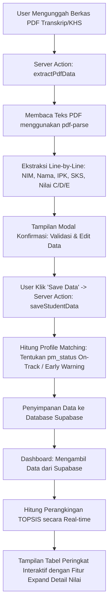

# Dokumentasi Sistem Pendukung Keputusan (SPK) Evaluasi Akademik Mahasiswa
## Metode Profile Matching & TOPSIS

Dokumentasi ini menjelaskan secara komprehensif mengenai arsitektur, alur kerja, metodologi perhitungan, skema database, serta panduan teknis untuk aplikasi **Student Performance Analytics** yang mengkombinasikan metode **Profile Matching** (untuk penentuan status kelayakan/peringatan dini) dan **TOPSIS** (untuk pemeringkatan global/kelas mahasiswa).

---

## 1. Pendahuluan
Aplikasi **Student Performance Analytics** dirancang untuk membantu program studi (Prodi) dalam mengevaluasi kinerja akademik mahasiswa secara objektif dan otomatis. Aplikasi ini memproses data transkrip akademik (berupa berkas PDF) yang diunggah, mengekstrak data nilai, menghitung status akademik mahasiswa berdasarkan kompetensi ideal yang diharapkan program studi (menggunakan **Profile Matching**), serta menyusun urutan prioritas atau peringkat kelayakan mahasiswa (menggunakan **TOPSIS**).

---

## 2. Arsitektur & Teknologi Stack
Aplikasi ini dibangun menggunakan arsitektur web modern dengan komponen-komponen berikut:
*   **Framework Utama**: Next.js 15 (React 19) dengan pola **App Router**.
*   **Bahasa Pemrograman**: TypeScript untuk menjamin tipe data yang aman (*type-safe*).
*   **Database & Autentikasi**: Supabase PostgreSQL untuk penyimpanan data mahasiswa secara *real-time*.
*   **Pengolahan Berkas**: `pdf-parse` pada sisi server (*Server Actions*) untuk ekstraksi teks baris demi baris secara lokal tanpa ketergantungan API pihak ketiga.
*   **Antarmuka Pengguna (UI)**: TailwindCSS dengan desain bertema gelap (*dark mode premium*) yang dipadukan dengan komponen dari Shadcn UI (Radix UI) dan Lucide Icons.

---

## 3. Alur Kerja Sistem (Workflow)

Alur kerja aplikasi dari awal pengunggahan berkas hingga visualisasi ranking digambarkan dalam diagram berikut:



### Penjelasan Detil Alur Kerja:
1.  **Pengunggahan Berkas**: Pengguna menyeret (*drag and drop*) atau memilih satu atau beberapa dokumen PDF transkrip nilai mahasiswa di dashboard.
2.  **Pemrosesan PDF**: Server mengekstrak informasi dasar (NIM, Nama, IPK) menggunakan ekspresi reguler (*regex*). Khusus untuk riwayat nilai, server melakukan *Line-by-line Course Processing* untuk menyaring mata kuliah dengan nilai C, D, dan E, serta menghitung SKS lulus bersih (tidak menghitung SKS kelas yang gagal/E).
3.  **Verifikasi & Konfirmasi**: Sistem menampilkan dialog konfirmasi yang memungkinkan pengguna untuk melakukan penyesuaian nama atau kelas sebelum disimpan ke database.
4.  **Kalkulasi Profile Matching & Penyimpanan**: Saat disimpan, sistem memanggil fungsi Profile Matching untuk menentukan status apakah mahasiswa tersebut berada pada kondisi `"On-Track"` (sesuai target standar prodi) atau membutuhkan `"Early Warning"` (peringatan dini).
5.  **Perangkingan TOPSIS & Visualisasi**: Saat data ditampilkan di dashboard, program menghitung skor preferensi TOPSIS secara dinamis berdasarkan data filter yang aktif (semua kelas atau kelas tertentu), menyusun peringkat dari skor tertinggi ke terendah, dan menampilkan detail mata kuliah bermasalah apabila baris tabel di-expand.

---

## 4. Metodologi SPK (Metode Perhitungan)

Sistem ini memadukan dua buah metode pengambilan keputusan multikriteria (MADM) yang memiliki peran yang berbeda:

### A. Metode Profile Matching (Penentu Status Akademik)
Metode ini digunakan untuk menilai tingkat kecocokan kompetensi akademis mahasiswa terhadap standar kompetensi kelulusan tepat waktu yang ditetapkan program studi. 

#### 1. Kriteria & Skala Penilaian (1 s.d. 5)
Data riil mahasiswa dikonversi terlebih dahulu ke dalam skala nilai 1 sampai 5.

*   **Indeks Prestasi Kumulatif (IPK)**:
    *   IPK $\ge 3.50$ $\rightarrow$ Skala **5**
    *   IPK $\ge 3.00$ $\rightarrow$ Skala **4**
    *   IPK $\ge 2.50$ $\rightarrow$ Skala **3**
    *   IPK $\ge 2.00$ $\rightarrow$ Skala **2**
    *   IPK $< 2.00$ $\rightarrow$ Skala **1**
*   **Total SKS Lulus**:
    *   SKS $\ge 120$ $\rightarrow$ Skala **5**
    *   SKS $\ge 80$ $\rightarrow$ Skala **4**
    *   SKS $\ge 40$ $\rightarrow$ Skala **3**
    *   SKS $\ge 20$ $\rightarrow$ Skala **2**
    *   SKS $< 20$ $\rightarrow$ Skala **1**
*   **Jumlah Nilai 'C'**:
    *   $0$ kali $\rightarrow$ Skala **5**
    *   $\le 2$ kali $\rightarrow$ Skala **4**
    *   $\le 4$ kali $\rightarrow$ Skala **3**
    *   $\le 6$ kali $\rightarrow$ Skala **2**
    *   $> 6$ kali $\rightarrow$ Skala **1**
*   **Jumlah Nilai 'D'**:
    *   $0$ kali $\rightarrow$ Skala **5**
    *   $1$ kali $\rightarrow$ Skala **3**
    *   $2$ kali $\rightarrow$ Skala **2**
    *   $\ge 3$ kali $\rightarrow$ Skala **1**
*   **Jumlah Nilai 'E'**:
    *   $0$ kali $\rightarrow$ Skala **5**
    *   $\ge 1$ kali $\rightarrow$ Skala **1** (*Double Penalty Logic*: Bahkan hanya dengan 1 nilai E, status akademik langsung dinilai buruk karena adanya kelas gagal).

#### 2. Standar Target (Profile Target)
Sistem menetapkan target kelulusan mahasiswa ideal pada tingkatan semester saat ini:
*   Target IPK: Skala **4** (setara IPK $\ge 3.00$)
*   Target SKS: Skala **4** (setara SKS $\ge 80$)
*   Target C: Skala **5** (tidak boleh ada nilai C / $0$)
*   Target D: Skala **5** (tidak boleh ada nilai D / $0$)
*   Target E: Skala **5** (tidak boleh ada nilai E / $0$)

#### 3. Penghitungan Selisih (Gap)
Selisih dihitung dengan mengurangi skala aktual mahasiswa dengan skala target:
$$\text{Gap} = \text{Skala Aktual} - \text{Skala Target}$$

#### 4. Pembobotan Nilai Gap
Nilai gap yang didapatkan dikonversi menjadi bobot nilai gap dengan ketentuan:

| Nilai Gap | Bobot Nilai | Keterangan |
| :---: | :---: | :--- |
| **0** | **5.0** | Kompetensi sesuai dengan kebutuhan (tidak ada selisih) |
| **1** | **4.5** | Kompetensi individu kelebihan 1 tingkat |
| **-1** | **4.0** | Kompetensi individu kekurangan 1 tingkat |
| **2** | **3.5** | Kompetensi individu kelebihan 2 tingkat |
| **-2** | **3.0** | Kompetensi individu kekurangan 2 tingkat |
| **3** | **2.5** | Kompetensi individu kelebihan 3 tingkat |
| **-3** | **2.0** | Kompetensi individu kekurangan 3 tingkat |
| **4** | **1.5** | Kompetensi individu kelebihan 4 tingkat |
| **-4** | **1.0** | Kompetensi individu kekurangan 4 tingkat |
| **Lainnya** | **1.0** | Kekurangan/kelebihan di luar batas |

#### 5. Pengelompokan Core Factor (CF) & Secondary Factor (SF)
Kriteria dikelompokkan menjadi dua kelompok faktor:
*   **Core Factor (NCF)**: Aspek utama kompetensi akademik, yaitu **IPK** dan **SKS**:
    $$\text{NCF} = \frac{\text{Bobot IPK} + \text{Bobot SKS}}{2}$$
*   **Secondary Factor (NSF)**: Aspek pendukung kinerja akademik, yaitu jumlah nilai **C, D, dan E**:
    $$\text{NSF} = \frac{\text{Bobot C} + \text{Bobot D} + \text{Bobot E}}{3}$$

#### 6. Penghitungan Total Score & Penentuan Status
Skor akhir Profile Matching menggabungkan kontribusi bobot sebesar **60% Core Factor** dan **40% Secondary Factor**:
$$\text{Total Score} = (0.6 \times \text{NCF}) + (0.4 \times \text{NSF})$$

*   Jika **Total Score $\ge 4.0$** $\rightarrow$ Status = **`On-Track`**
*   Jika **Total Score $< 4.0$** $\rightarrow$ Status = **`Early Warning`**

---

### B. Metode TOPSIS (Sistem Perangkingan Alternatif)
Metode *Technique for Order of Preference by Similarity to Ideal Solution* (TOPSIS) digunakan untuk memberikan peringkat prioritas mahasiswa dari yang terbaik hingga terlemah berdasarkan kedekatan geometris alternatif dengan solusi ideal.

#### 1. Kriteria & Bobot Preferensi TOPSIS ($w_j$)
Pembobotan dirancang agar kriteria bertipe *benefit* (keuntungan) memiliki bobot lebih tinggi, dan kriteria bermasalah bertipe *cost* (biaya) dikurangi:
*   **IPK ($C_1$)**: $0.50$ (Benefit - Maksimal)
*   **SKS ($C_2$)**: $0.30$ (Benefit - Maksimal)
*   **Jumlah C ($C_3$)**: $0.0667$ (Cost - Minimal)
*   **Jumlah D ($C_4$)**: $0.0667$ (Cost - Minimal)
*   **Jumlah E ($C_5$)**: $0.0666$ (Cost - Minimal)
*(Total bobot $= 1.0$ atau $100\%$)*

#### 2. Normalisasi Matriks Keputusan ($r_{ij}$)
Setiap nilai alternatif mahasiswa dinormalisasi untuk membandingkan kriteria dengan skala unit yang berbeda:
$$r_{ij} = \frac{x_{ij}}{\sqrt{\sum_{k=1}^{m} x_{kj}^2}}$$
Di mana $x_{ij}$ merupakan nilai mahasiswa ke-$i$ pada kriteria ke-$j$.

#### 3. Normalisasi Terbobot ($y_{ij}$)
Mengalikan matriks ternormalisasi dengan bobot preferensi kriteria:
$$y_{ij} = r_{ij} \times w_j$$

#### 4. Menentukan Solusi Ideal Positif ($A^+$) dan Solusi Ideal Negatif ($A^-$)
*   **Solusi Ideal Positif ($A^+$)** mengambil nilai maksimum pada kriteria benefit dan nilai minimum pada kriteria cost:
    $$A^+ = \{ y_1^+, y_2^+, ..., y_n^+ \}$$
    *   $y_{\text{ipk}}^+ = \max(y_{i,\text{ipk}})$
    *   $y_{\text{sks}}^+ = \max(y_{i,\text{sks}})$
    *   $y_c^+ = \min(y_{i,c})$
    *   $y_d^+ = \min(y_{i,d})$
    *   $y_e^+ = \min(y_{i,e})$
*   **Solusi Ideal Negatif ($A^-$)** mengambil nilai minimum pada kriteria benefit dan nilai maksimum pada kriteria cost:
    $$A^- = \{ y_1^-, y_2^-, ..., y_n^- \}$$
    *   $y_{\text{ipk}}^- = \min(y_{i,\text{ipk}})$
    *   $y_{\text{sks}}^- = \min(y_{i,\text{sks}})$
    *   $y_c^- = \max(y_{i,c})$
    *   $y_d^- = \max(y_{i,d})$
    *   $y_e^- = \max(y_{i,e})$

#### 5. Perhitungan Jarak Alternatif ke Solusi Ideal ($D_i^+$ dan $D_i^-$)
*   Jarak ke Solusi Ideal Positif ($D_i^+$):
    $$D_i^+ = \sqrt{\sum_{j=1}^{n} (y_{ij} - y_j^+)^2}$$
*   Jarak ke Solusi Ideal Negatif ($D_i^-$):
    $$D_i^- = \sqrt{\sum_{j=1}^{n} (y_{ij} - y_j^-)^2}$$

#### 6. Perhitungan Nilai Preferensi Peringkat ($V_i$)
Nilai kedekatan relatif yang menggambarkan peringkat alternatif:
$$V_i = \frac{D_i^-}{D_i^+ + D_i^-}$$
Nilai $V_i$ berkisar antara $0$ hingga $1$. Mahasiswa dengan nilai $V_i$ mendekati $1$ akan menempati urutan peringkat teratas pada dashboard.

---

## 5. Skema Database
Sistem menggunakan satu tabel utama pada database Supabase (PostgreSQL) dengan struktur skema sebagai berikut:

### Tabel `students`
| Kolom | Tipe Data | Deskripsi |
| :--- | :--- | :--- |
| `nim` | `VARCHAR(15)` **(Primary Key)** | Nomor Induk Mahasiswa sebagai identitas unik |
| `name` | `VARCHAR(100)` | Nama lengkap mahasiswa |
| `class_name` | `VARCHAR(20)` | Kelas akademik mahasiswa (contoh: `TPLP-028`) |
| `ipk` | `NUMERIC(3,2)` | Indeks Prestasi Kumulatif (0.00 s.d. 4.00) |
| `sks_total` | `INTEGER` | Total akumulasi SKS lulus bersih |
| `count_c` | `INTEGER` | Jumlah mata kuliah dengan nilai C |
| `count_d` | `INTEGER` | Jumlah mata kuliah dengan nilai D |
| `count_e` | `INTEGER` | Jumlah mata kuliah dengan nilai E (gagal) |
| `bad_grades` | `JSONB` | Array objek mata kuliah bernilai kurang: `[{ "course": string, "grade": string, "sks": number }]` |
| `pm_status` | `VARCHAR(20)` | Status kelayakan hasil Profile Matching (`On-Track` / `Early Warning`) |
| `last_updated` | `TIMESTAMP` | Waktu pembaharuan data terakhir |

---

## 6. Panduan Menjalankan Aplikasi Secara Lokal

### Prasyarat
*   Sudah menginstal **Node.js** (versi 18.x atau yang terbaru).
*   Memiliki akun dan proyek aktif di **Supabase**.

### Pengaturan Environment Variables (`.env.local`)
Buat file bernama `.env.local` pada direktori utama proyek Anda dan isi kredensial berikut:
```env
NEXT_PUBLIC_SUPABASE_URL=https://your-project-id.supabase.co
NEXT_PUBLIC_SUPABASE_ANON_KEY=your-anonymous-api-key
```

### Langkah Menjalankan Aplikasi:
1.  Buka terminal pada direktori proyek.
2.  Pasang semua dependensi proyek:
    ```bash
    npm install
    ```
3.  Jalankan server pengembangan lokal:
    ```bash
    npm run dev
    ```
4.  Buka browser Anda dan akses halaman di alamat [http://localhost:3000](http://localhost:3000).

---
*Dokumentasi ini disusun sebagai panduan resmi sistem pendukung keputusan program evaluasi akademik mahasiswa.*
